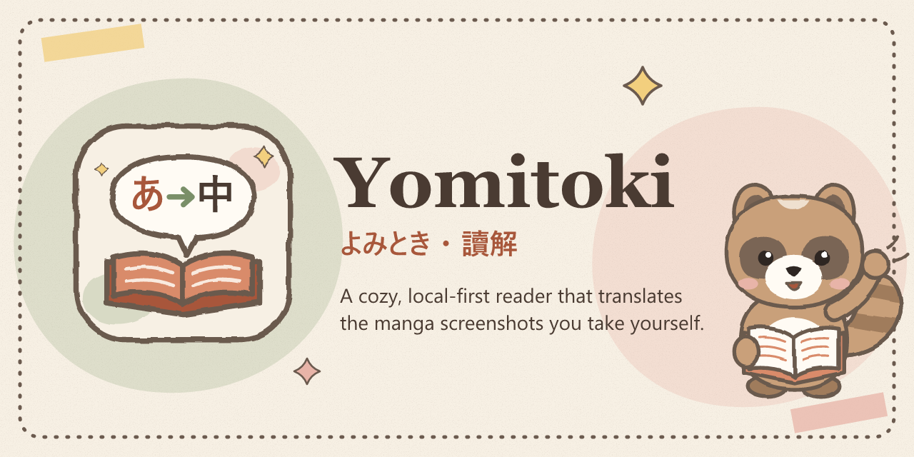

<p align="center">
  
</p>

<p align="center">
  <br>
  <b>Yomitoki（よみとき・讀解）</b><br>
  English · <a href="README.zh-TW.md">繁體中文</a>
</p>

Yomitoki is a personal, multilingual manga reading tool. It runs OCR, translation and typesetting on screenshots **you take yourself**, then lets you read the result in a local, hand-drawn-style reader.

> **Status: pre-alpha.** M1 (skeleton and brand), M2 (translation core), M3 (UI: shelf, series page, reader, glossary, settings) and M4 (Chrome extension, see [extension/README.md](extension/README.md)) are done. The installer is not implemented yet.

## Usage notice

Yomitoki is for **personal reading and comprehension only**.

- You are responsible for following the terms of service of any site you read on, and the copyright law where you live.
- **Do not distribute translated output.** Keep it on your own computer.
- Yomitoki only processes screenshots you capture yourself. It does not download, intercept or reconstruct images from websites. It contains no code that targets any particular site.

## How it will work

1. Press a hotkey in the browser extension to capture what is on screen.
2. The local backend (bound to `127.0.0.1` only) detects speech bubbles and runs OCR.
3. Only the recognized text is sent for translation, through **your own logged-in Claude Code** (no API key needed). Screenshots never leave your computer.
4. The original text is removed, the translation is typeset back into the page, and the result opens in the reader.

Each series keeps its own memory: a glossary, style rules and a plot summary. Character names therefore stay consistent. New terms are held as "pending" until you confirm them.

## Roadmap

| Version | Features |
| --- | --- |
| v0.1 | Page manga translation (single page or whole episode), language plug-in architecture, Japanese → Traditional Chinese, per-series memory, Claude Code translation, local reader |
| v0.2 | Vertical-scroll (webtoon) mode, Korean → Traditional Chinese, re-apply glossary without re-running OCR |
| v0.3 | English and Chinese sources; English, Japanese and Korean targets; English UI |

Development milestones: M1 skeleton and brand ✅ · M2 translation core ✅ · M3 UI ✅ · M4 browser extension ✅ · M5 installer · M6 v0.1 release.

## Customizing the look

The illustrations, mascot and icons are all **replaceable assets**. The UI loads images by asset ID, never by hard-coded file name.

1. Find the asset ID and recommended size in [`assets/manifest.json`](assets/manifest.json), for example `mascot-welcome` (800 × 800, transparent).
2. Save your image as `Documents\Yomitoki\custom-assets\mascot-welcome.png`. SVG, PNG and WebP all work. For raster images, use twice the recommended size.
3. Your image replaces the default. If the size or ratio differs, it is scaled to fit and centered, never cropped or stretched. To go back, delete the file.

To rebuild every icon size from a new source image:

```bash
python scripts/build-icons.py --source path/to/my-icon.png
```

## Trying the translation core

There is no installer yet (planned for M5). Set up the development environment by following [docs/development.md](docs/development.md). Then:

```bash
yomitoki setup
yomitoki translate tests/fixtures/ja-page-01.png -o out.png
```

For a whole episode with per-series memory:

```bash
yomitoki series new "My Series"
yomitoki episode run "My Series" 1
```

Or run `yomitoki serve` and open http://127.0.0.1:8765 to use the UI (build it first with `npm run build` in `ui/`).

## Development

Requirements: Python 3.11 (manga-image-translator does not support 3.12 yet), and Node.js 20+ from M3 on. See [docs/development.md](docs/development.md) for the full setup.

```bash
.venv\Scripts\python -m pytest            # unit tests, no GPU or Claude Code needed
.venv\Scripts\python -m pytest -m gpu     # runs the real detection / OCR / inpainting models
```

Useful scripts:

| Script | What it does |
| --- | --- |
| `scripts/check-contrast.py` | Checks that every text and background pair in `ui/src/styles/tokens.css` passes WCAG AA, in both light and night mode |
| `scripts/build-icons.py` | Builds `.ico` and `.png` icons for Windows, the tray, the extension, favicons and the social preview |
| `scripts/make-default-art.py` | Regenerates the default hand-drawn SVG artwork |

Open [`docs/brand.html`](docs/brand.html) in a browser to see the palette, typography and every default asset on one page.

## License

- Code: [GPL-3.0](LICENSE). Yomitoki builds on manga-image-translator, which is GPL-3.0.
- Default artwork in `assets/`: [CC BY 4.0](assets/LICENSE.md).
- Third-party components and fonts: see [THIRD_PARTY_NOTICES.md](THIRD_PARTY_NOTICES.md).
